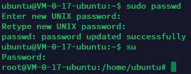

## 服务器2019/7/10
>服务器重置了，又是新的开始

#### 重新登录，设置root密码，即可登录root权限


#### 安装nodejs
>安装参考 https://www.jianshu.com/p/a9212848a34f

- 安装最新版node 10.x
> curl -sL https://deb.nodesource.com/setup_10.x | sudo -E bash -
   sudo apt-get install -y nodejs
   node -v # v10.16.0
   npm -v #  v6.9.0

- 找不到npm
>  `npm--Node package manager， is a part of node`
   npm -v `-bash: /usr/local/bin/npm: No such file or directory`
   /usr/bin/npm -v # 6.9.0
   > `创建 npm 再本地目录的链接文件`
   ln -s /usr/bin/npm /usr/local/bin/npm
  >另外，
   > 安装全局的 npm
   /usr/bin/npm install npm -g
   >安装最新的 npm
   /usr/bin/npm install npm@latest -g
#### 换阿里源
>参考 https://www.cnblogs.com/hcl1991/p/7894958.html

#### 安装nginx
> 安装参考 ubuntu版 http://nginx.org/en/linux_packages.html
> 完全卸载参考 https://blog.csdn.net/adley_app/article/details/79223221
> 卸载后重启确认已完全删除``` sudo service nginx restart ``` #重启nginx


##### nginx反向代理
- 配置文件
	- 配置文件默认路径  /etc/nginx/conf.d
	> 在该文件夹下新建wekan.conf
	server {
	    listen       80;
		server_name  wekan.tzjyqs.cn;  
	    location / {
	        root   /usr/share/nginx/html;
	        index  index.html index.htm;
	        proxy_pass http://xxx.xxx.xxx.xx:8080;
	    }
	    error_page   500 502 503 504  /50x.html;
	    location = /50x.html {
	        root   /usr/share/nginx/html;
	    }
}

- 使用域名需在腾讯云中添加记录
	- 登录腾讯云-域名管理-解析-添加记录
	

	

#### 安装docker
> 安装参考 https://docs.docker.com/install/linux/docker-ce/ubuntu/

- docker 删除所有容器和镜像
>停止运行所有镜像 ``` docker container   stop   $(docker  container  ls   -a  -q) ```
> 删除所有容器 ``` docker rm `docker ps -a -q` ```
> 删除所有镜像 ``` docker rmi `docker images -q` ```
> 注意！必须先删除容器才能删除镜像，否则会显示镜像被占用无法删除。
#### 安装docker compose
> 安装参考 https://docs.docker.com/compose/install/

#### 安装wekan（docker方式）
##### 方法一 docker直接安装2个镜像
> 安装参考 https://github.com/wekan/wekan/wiki/Docker

- 安装MongoDB镜像
> docker run -d --restart=always --name wekan-db mongo:3.2.20

- 安装wekan镜像(最新版本）
> docker run -d --restart=always --name wekan --link "wekan-db:db" -e "MONGO_URL=mongodb://db" -e "ROOT_URL=http://xxx.xxx.xx.xx:8080" -p 8080:8080 quay.io/wekan/wekan
>
> --link docker 中安装的mongo name ,此处为 wekan-db
> -e ROOT_URL: 映射的外部访问连接，可以是ip地址 可以是本机绑定的域名域名

##### 方法二 docker-compose 安装
> 安装参考 https://github.com/wekan/wekan-mongodb

- 修改docker-compose.yml
```
version: '2'
ervices:
  wekandb:
     container_name: wekan-db
    restart: always
    command: mongod --smallfiles --oplogSize 128
    networks:
      - wekan-tier
    expose:
      - 27017
    volumes:
      - wekan-db:/data/db
      - wekan-db-dump:/dump

  wekan:
    container_name: wekan-app
    restart: always
    networks:
      - wekan-tier
   ports:
      - 3001:8080
    environment:
      - MONGO_URL=mongodb://wekandb:27017/wekan
	  - ROOT_URL=http://http://xxxx.xxx.xxx.xx:3001     #<=== using only at same laptop/desktop where Wekan is installed
      - MAIL_URL='smtp://<mail_url>:25/?ignoreTLS=true&tls={rejectUnauthorized:false}'
      - MAIL_FROM='Wekan Notifications <noreply.wekan@mydomain.com>'
     - BROWSER_POLICY_ENABLED=true
    depends_on:
      - wekandb
  wekan-db:
    driver: local
  wekan-db-dump:
    driver: local
networks:
  wekan-tier:
    driver: bridge
  ```